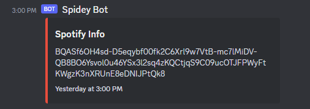

# Discotify
Discotify is a Discord/Spotify bot solution to enhance user experiences when listening to Spotify music in Discord parties. Our Discord bot solution allows multiple people to control Spotify listening parties instead of a single person. Your listening experience can now become fun and collaborative!
Users who would benefit most from this program would be users who have Spotify premium and actively use Discord with friends or other people.
Once users are in Discord and in each others Spotify listening parties, users can send commands to the bot. These commands include but are not limited to actions such as start track, pause track, skip track, and add to queue.


# How to run

1. Ensure you have python3 installed on your system. 
    - To check that python is installed properly run this command in your terminal:
        ```
        python --version
        ```
    - If the previous commands does not work try:
        ```
        python3 --version
        ```
    - If the command is successful you will see your current python version installed

2. Open a terminal or command prompt.

3. Use the following command to install the required modules using pip, the package installer for Python:

        pip install discord jsonlib base64 requests

4. Wait for the installation to complete. Once finished, the required modules will be installed in the Python environment.

5. Run executable.
        


# How to contribute
Follow this project board to know the latest status of the project: [http://...]([http://...])  

### How to build
https://github.com/orgs/cis3296f23/projects/112

- Use this github repository: ... 
- Specify what branch to use for a more stable release or for cutting edge development.  
- Use InteliJ 11
- Specify additional library to download if needed 
- What file and target to compile and run. 
- What is expected to happen when the app start.

# Troubleshooting Problems
Continuously adding new problems that come up through development or building, will post common problems and solutions for current/future developers to refer to.

### Compiling/Building Issues
If `pip install discord jsonlib base64 requests` doesn't work and you are on macOS, try removing the base64 and see if that works.
Make sure you are also using the correct interpreter for your IDE if you using that to run the program.
you can check what interpreter your terminal is using with `which python` or `which python3`.
